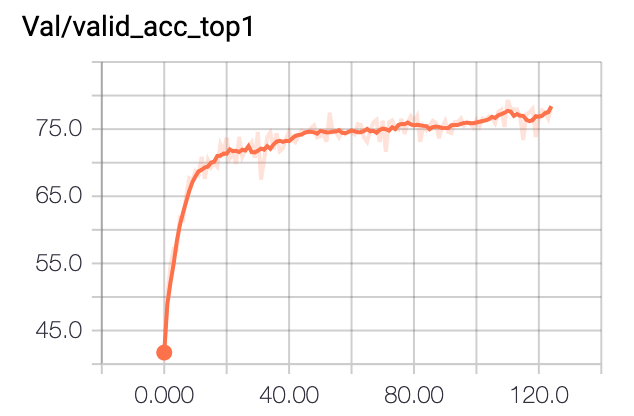
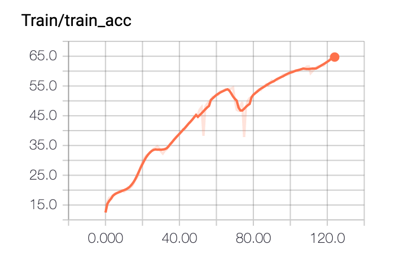
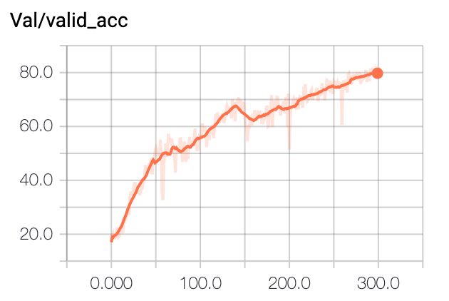
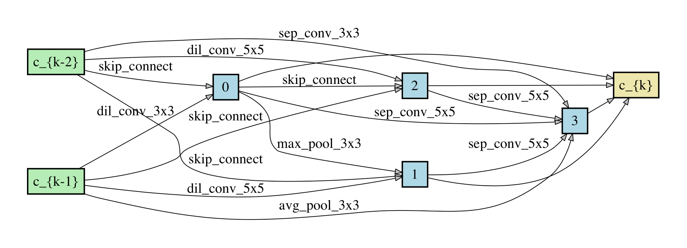
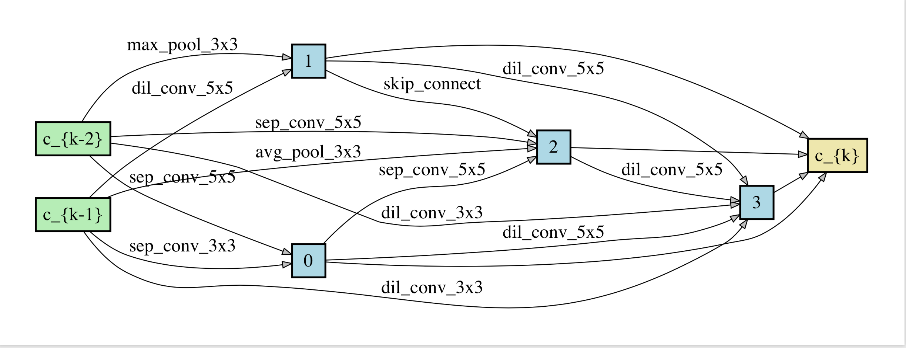

# SNAS(Stochastic Neural Architecture Search)
Pytorch implementation of SNAS (Caution : This is not official version and was not written by the author of the paper)

## Requirements
```
Python >= 3.6.5, PyTorch == 1.0
```

## Datasets
Cifar-10

## Hyperparameters
I followed hyperparameters that were given in the paper.

However, there are several parameters that were not given in the paper.

Ex) Softmax Temperature ($ \lambda_{0} $) , annealiation rate of the softmax temperature, parameters regarding the levels of resource constraints
# Run the training code
```
bash scripts/main_constraint_new.sh (WITH resource contraint)
```
# Evaluation the searched architecture
```
bash scripts/retrain.sh (WITH resource contraint)
```

## Search Validation Accuracy (with resource constraint)
<p align="center">

</p>
<p align="center">
Figure1 : Search Validation Accuracy
</p>
(Note : the model was not fully trained(<==>converged) due to the limited resources (E.g., GPU and TIME!!)

## Search Validation Accuracy of ENAS
<p align="center">

</p>
<p align="center">
Figure2 : Search Validation Accuracy of ENAS
</p>

## Network Architecture (with resource constraint at epoch 120)
<p align="center">


</p>
<p align="center">
Figure3 : Network Architecture of normal cell (left) and reduction cell (right)
</p>

#Evaluation results on cifar10
|    Architecture    | Accuracy | Params |
| SNAS |  96.27% | 4.6M |
| ENAS |  97.01% | 2.9M |

## Reference
https://github.com/quark0/darts/
